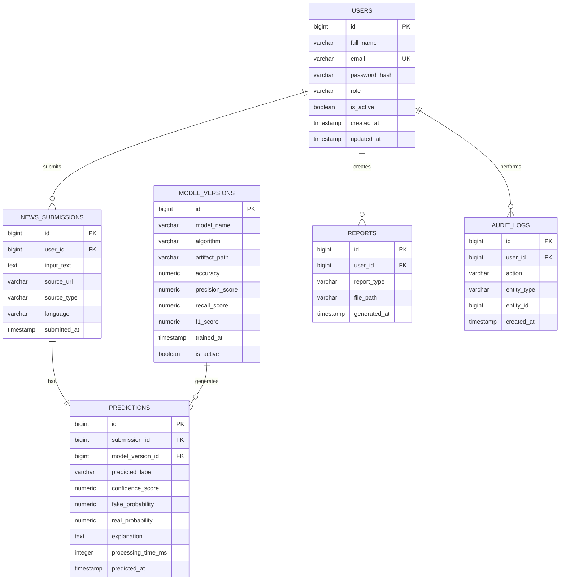

# Database Schema Design

## AI-Based Fake News Detection System

> Status: Assumption-based database design.
>
> The official proposal is not currently available in the workspace. This schema should be validated after proposal review, especially user roles, prediction labels, dataset requirements, and reporting scope.

## 1. Database Overview

Recommended database: PostgreSQL.

The database is designed to support:

- User authentication and role-based access.
- News text or URL submissions.
- AI prediction storage.
- Model version traceability.
- Admin analytics.
- Report tracking.
- Audit logging.

## 2. Entity Summary

| Entity | Purpose |
|---|---|
| `users` | Stores registered users and admins. |
| `news_submissions` | Stores submitted news content or extracted URL content. |
| `model_versions` | Stores trained model metadata and evaluation metrics. |
| `predictions` | Stores prediction output for each submission. |
| `reports` | Stores generated report metadata. |
| `audit_logs` | Stores important user/admin actions. |

## 3. ER Diagram



## 4. PostgreSQL DDL

### 4.1 Create Enum Types

```sql
CREATE TYPE user_role AS ENUM ('user', 'admin');
CREATE TYPE submission_source_type AS ENUM ('text', 'url');
CREATE TYPE prediction_label AS ENUM ('fake', 'real', 'misleading', 'suspicious', 'uncertain');
CREATE TYPE report_type AS ENUM ('usage', 'model_performance', 'prediction_summary', 'academic');
```

### 4.2 Users Table

```sql
CREATE TABLE users (
    id BIGSERIAL PRIMARY KEY,
    full_name VARCHAR(150) NOT NULL,
    email VARCHAR(255) NOT NULL UNIQUE,
    password_hash VARCHAR(255) NOT NULL,
    role user_role NOT NULL DEFAULT 'user',
    is_active BOOLEAN NOT NULL DEFAULT TRUE,
    created_at TIMESTAMPTZ NOT NULL DEFAULT NOW(),
    updated_at TIMESTAMPTZ NOT NULL DEFAULT NOW(),
    CONSTRAINT chk_users_email_not_blank CHECK (length(trim(email)) > 0),
    CONSTRAINT chk_users_full_name_not_blank CHECK (length(trim(full_name)) > 0)
);
```

### 4.3 Model Versions Table

```sql
CREATE TABLE model_versions (
    id BIGSERIAL PRIMARY KEY,
    model_name VARCHAR(150) NOT NULL,
    algorithm VARCHAR(150) NOT NULL,
    artifact_path VARCHAR(500) NOT NULL,
    dataset_name VARCHAR(200),
    dataset_version VARCHAR(100),
    accuracy NUMERIC(5,4),
    precision_score NUMERIC(5,4),
    recall_score NUMERIC(5,4),
    f1_score NUMERIC(5,4),
    trained_at TIMESTAMPTZ NOT NULL DEFAULT NOW(),
    is_active BOOLEAN NOT NULL DEFAULT FALSE,
    notes TEXT,
    CONSTRAINT chk_model_accuracy CHECK (accuracy IS NULL OR (accuracy >= 0 AND accuracy <= 1)),
    CONSTRAINT chk_model_precision CHECK (precision_score IS NULL OR (precision_score >= 0 AND precision_score <= 1)),
    CONSTRAINT chk_model_recall CHECK (recall_score IS NULL OR (recall_score >= 0 AND recall_score <= 1)),
    CONSTRAINT chk_model_f1 CHECK (f1_score IS NULL OR (f1_score >= 0 AND f1_score <= 1))
);
```

### 4.4 News Submissions Table

```sql
CREATE TABLE news_submissions (
    id BIGSERIAL PRIMARY KEY,
    user_id BIGINT NOT NULL REFERENCES users(id) ON DELETE CASCADE,
    input_text TEXT NOT NULL,
    source_url VARCHAR(1000),
    source_type submission_source_type NOT NULL DEFAULT 'text',
    language VARCHAR(20) DEFAULT 'en',
    submitted_at TIMESTAMPTZ NOT NULL DEFAULT NOW(),
    CONSTRAINT chk_submission_text_not_blank CHECK (length(trim(input_text)) > 0),
    CONSTRAINT chk_url_required_for_url_source CHECK (
        source_type = 'text' OR (source_type = 'url' AND source_url IS NOT NULL)
    )
);
```

### 4.5 Predictions Table

```sql
CREATE TABLE predictions (
    id BIGSERIAL PRIMARY KEY,
    submission_id BIGINT NOT NULL UNIQUE REFERENCES news_submissions(id) ON DELETE CASCADE,
    model_version_id BIGINT NOT NULL REFERENCES model_versions(id) ON DELETE RESTRICT,
    predicted_label prediction_label NOT NULL,
    confidence_score NUMERIC(5,4) NOT NULL,
    fake_probability NUMERIC(5,4),
    real_probability NUMERIC(5,4),
    explanation TEXT,
    processing_time_ms INTEGER,
    predicted_at TIMESTAMPTZ NOT NULL DEFAULT NOW(),
    CONSTRAINT chk_confidence_range CHECK (confidence_score >= 0 AND confidence_score <= 1),
    CONSTRAINT chk_fake_probability_range CHECK (fake_probability IS NULL OR (fake_probability >= 0 AND fake_probability <= 1)),
    CONSTRAINT chk_real_probability_range CHECK (real_probability IS NULL OR (real_probability >= 0 AND real_probability <= 1)),
    CONSTRAINT chk_processing_time_non_negative CHECK (processing_time_ms IS NULL OR processing_time_ms >= 0)
);
```

### 4.6 Reports Table

```sql
CREATE TABLE reports (
    id BIGSERIAL PRIMARY KEY,
    user_id BIGINT NOT NULL REFERENCES users(id) ON DELETE CASCADE,
    report_type report_type NOT NULL,
    title VARCHAR(200) NOT NULL,
    file_path VARCHAR(500),
    generated_at TIMESTAMPTZ NOT NULL DEFAULT NOW(),
    CONSTRAINT chk_report_title_not_blank CHECK (length(trim(title)) > 0)
);
```

### 4.7 Audit Logs Table

```sql
CREATE TABLE audit_logs (
    id BIGSERIAL PRIMARY KEY,
    user_id BIGINT REFERENCES users(id) ON DELETE SET NULL,
    action VARCHAR(100) NOT NULL,
    entity_type VARCHAR(100),
    entity_id BIGINT,
    ip_address INET,
    user_agent TEXT,
    created_at TIMESTAMPTZ NOT NULL DEFAULT NOW(),
    CONSTRAINT chk_audit_action_not_blank CHECK (length(trim(action)) > 0)
);
```

## 5. Indexes

```sql
CREATE INDEX idx_users_email ON users(email);
CREATE INDEX idx_users_role ON users(role);

CREATE INDEX idx_submissions_user_id ON news_submissions(user_id);
CREATE INDEX idx_submissions_submitted_at ON news_submissions(submitted_at);
CREATE INDEX idx_submissions_source_type ON news_submissions(source_type);

CREATE INDEX idx_predictions_model_version_id ON predictions(model_version_id);
CREATE INDEX idx_predictions_label ON predictions(predicted_label);
CREATE INDEX idx_predictions_predicted_at ON predictions(predicted_at);
CREATE INDEX idx_predictions_confidence ON predictions(confidence_score);

CREATE INDEX idx_model_versions_active ON model_versions(is_active);
CREATE INDEX idx_model_versions_trained_at ON model_versions(trained_at);

CREATE INDEX idx_reports_user_id ON reports(user_id);
CREATE INDEX idx_reports_type ON reports(report_type);

CREATE INDEX idx_audit_logs_user_id ON audit_logs(user_id);
CREATE INDEX idx_audit_logs_created_at ON audit_logs(created_at);
CREATE INDEX idx_audit_logs_action ON audit_logs(action);
```

## 6. Active Model Constraint

PostgreSQL does not directly support a simple table constraint for "only one active model" when inactive rows are allowed. Use a partial unique index:

```sql
CREATE UNIQUE INDEX idx_only_one_active_model
ON model_versions (is_active)
WHERE is_active = TRUE;
```

## 7. Updated Timestamp Trigger

```sql
CREATE OR REPLACE FUNCTION set_updated_at()
RETURNS TRIGGER AS $$
BEGIN
    NEW.updated_at = NOW();
    RETURN NEW;
END;
$$ LANGUAGE plpgsql;

CREATE TRIGGER trg_users_updated_at
BEFORE UPDATE ON users
FOR EACH ROW
EXECUTE FUNCTION set_updated_at();
```

## 8. Seed Data

### 8.1 Initial Model Version

```sql
INSERT INTO model_versions (
    model_name,
    algorithm,
    artifact_path,
    dataset_name,
    dataset_version,
    accuracy,
    precision_score,
    recall_score,
    f1_score,
    is_active,
    notes
) VALUES (
    'Baseline Fake News Classifier',
    'TF-IDF + Logistic Regression',
    'backend/app/ml/artifacts/tfidf_logreg_v1.joblib',
    'Pending dataset confirmation',
    'v1',
    NULL,
    NULL,
    NULL,
    NULL,
    TRUE,
    'Initial placeholder model metadata. Replace metrics after training.'
);
```

### 8.2 Admin User

Do not insert a plain password. The application should create the admin user using a seed script that hashes the password first.

Recommended seed script behavior:

1. Read admin email and password from environment variables.
2. Hash the password using bcrypt or Argon2.
3. Insert admin record if email does not already exist.
4. Never print the password or hash to logs.

## 9. Example Analytical Queries

### 9.1 Prediction Label Distribution

```sql
SELECT predicted_label, COUNT(*) AS total
FROM predictions
GROUP BY predicted_label
ORDER BY total DESC;
```

### 9.2 Daily Submissions

```sql
SELECT DATE(submitted_at) AS submission_date, COUNT(*) AS total
FROM news_submissions
GROUP BY DATE(submitted_at)
ORDER BY submission_date DESC;
```

### 9.3 User Prediction History

```sql
SELECT
    ns.id AS submission_id,
    ns.submitted_at,
    ns.source_type,
    p.id AS prediction_id,
    p.predicted_label,
    p.confidence_score,
    mv.model_name
FROM news_submissions ns
JOIN predictions p ON p.submission_id = ns.id
JOIN model_versions mv ON mv.id = p.model_version_id
WHERE ns.user_id = :user_id
ORDER BY ns.submitted_at DESC
LIMIT :limit OFFSET :offset;
```

### 9.4 Model Usage Count

```sql
SELECT
    mv.model_name,
    mv.algorithm,
    COUNT(p.id) AS prediction_count
FROM model_versions mv
LEFT JOIN predictions p ON p.model_version_id = mv.id
GROUP BY mv.id, mv.model_name, mv.algorithm
ORDER BY prediction_count DESC;
```

## 10. Data Integrity Rules

- Every news submission must belong to a user.
- Every prediction must belong to one submission.
- A submission should have at most one prediction in the first system version.
- Every prediction must reference the model version that generated it.
- User emails must be unique.
- Confidence and probability values must be between 0 and 1.
- Raw passwords must never be stored.
- Admin access should be enforced by application logic using the `role` field.

## 11. Privacy and Retention Notes

For a university prototype, storing submitted news text is useful for history and evaluation. For a production system, add:

- User-controlled deletion of submission history.
- Optional anonymization of old submissions.
- Data retention policy.
- Clear privacy notice.
- Avoidance of personally identifiable information in submitted text where possible.

## 12. Migration Guidance

Recommended migration tool: Alembic.

Suggested migration order:

1. Create enum types.
2. Create `users`.
3. Create `model_versions`.
4. Create `news_submissions`.
5. Create `predictions`.
6. Create `reports`.
7. Create `audit_logs`.
8. Create indexes.
9. Create triggers.
10. Insert seed model metadata.

Recommended migration naming:

```text
0001_create_initial_schema.py
0002_add_model_metadata.py
0003_add_reports_and_audit_logs.py
```

## 13. Future Schema Enhancements

Potential enhancements:

- `datasets` table for dataset metadata.
- `training_runs` table for experiment tracking.
- `feedback` table for user feedback on predictions.
- `fact_check_sources` table for external fact-check references.
- `prediction_explanations` table for structured explanation terms.
- `api_keys` table if third-party integrations are added.

## 14. Proposal Confirmation Checklist

Update this schema after confirming:

- Exact user roles.
- Exact prediction labels.
- Whether URL submission is mandatory.
- Whether user feedback is required.
- Whether dataset management needs full upload support.
- Whether reports are generated files or dashboard-only summaries.
- Whether multilingual content must be stored.
