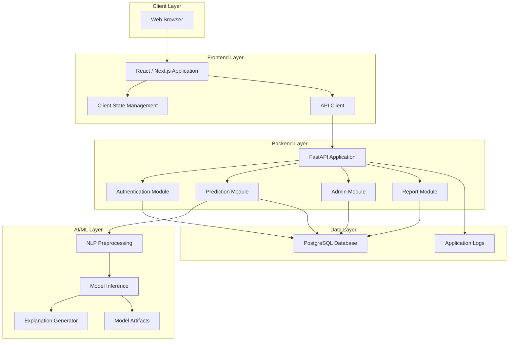
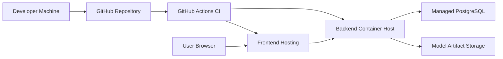
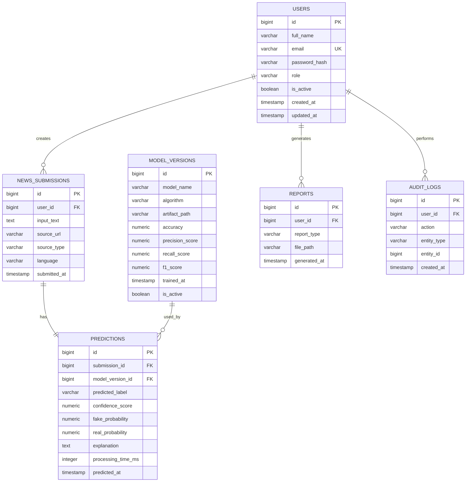
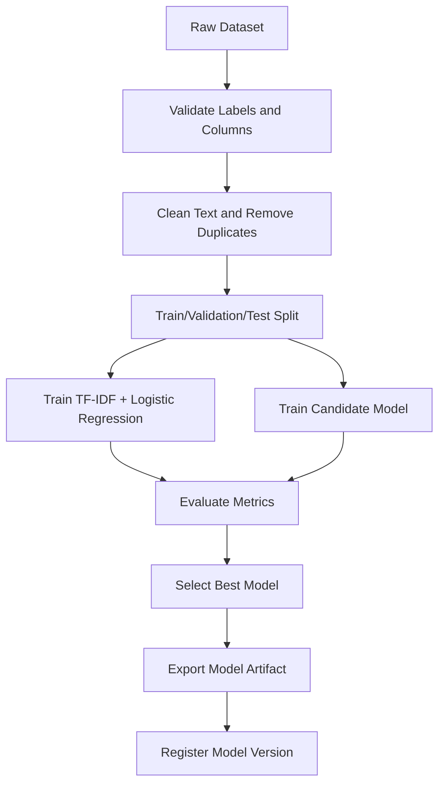
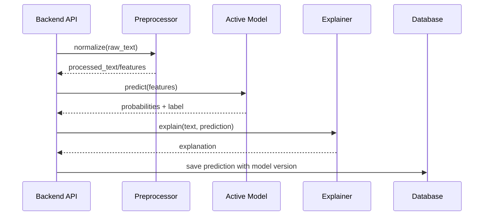
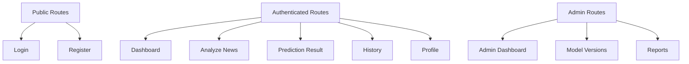
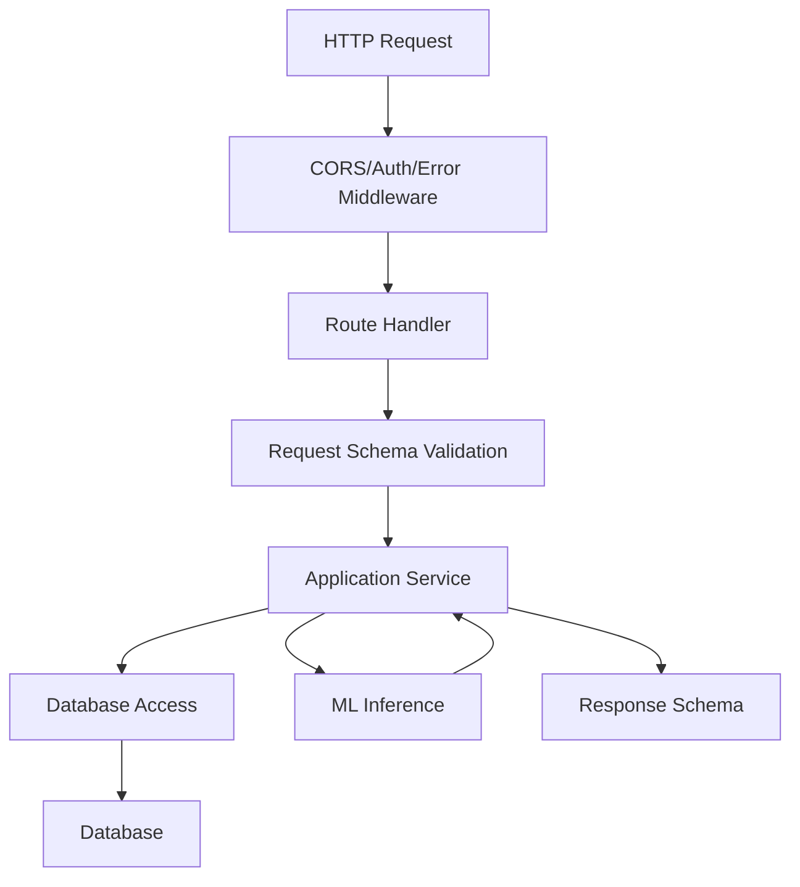
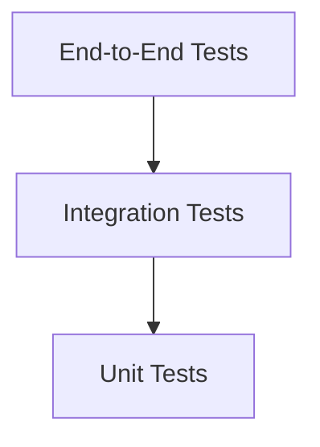

# System Design Document

## AI-Based Fake News Detection System

> Status: Assumption-based design draft.
>
> The original proposal is not currently available in the workspace. This design is based on `PROJECT_BLUEPRINT.md` and `SRS.md` and must be reconciled with the official proposal before final academic submission.

## 1. Design Overview

### 1.1 Purpose

This document describes the proposed system architecture, module decomposition, data design, API design, AI/ML workflow, security design, deployment design, and testing design for an AI-Based Fake News Detection System.

### 1.2 Design Goals

- Provide a usable web interface for fake news checking.
- Keep the frontend, backend, database, and AI model responsibilities clearly separated.
- Support reproducible ML training and versioned inference.
- Store prediction history for transparency and reporting.
- Provide enough explainability for academic and user-facing evaluation.
- Keep the implementation realistic for a final-year project timeline.

### 1.3 Design Principles

- Modular design.
- API-first backend.
- Secure authentication and authorization.
- Reproducible ML workflow.
- Clear separation between training and inference.
- Database-backed auditability.
- User-friendly result presentation.

## 2. High-Level Architecture



### 2.1 Architecture Style

Recommended style: Modular monolith for the final-year implementation.

Reasoning:

- Easier to build, test, and demonstrate within academic timelines.
- Avoids unnecessary distributed-system complexity.
- Still preserves clear module boundaries.
- Can later evolve into microservices if the ML inference workload grows.

### 2.2 Deployment View



## 3. Module Design

### 3.1 Frontend Modules

| Module | Responsibility |
|---|---|
| Auth UI | Login, registration, session handling, protected routes. |
| Dashboard UI | User landing area, recent predictions, quick actions. |
| Prediction UI | Text/URL input form, validation, loading state, result rendering. |
| History UI | List previous submissions and prediction details. |
| Admin UI | Analytics, model versions, dataset metadata, reports. |
| Shared UI | Buttons, forms, alerts, tables, layout components. |
| API Client | Centralized HTTP calls, token attachment, error normalization. |

### 3.2 Backend Modules

| Module | Responsibility |
|---|---|
| Auth Module | Registration, login, password hashing, JWT issuing, current-user lookup. |
| User Module | User profile and role management. |
| Submission Module | Validate and store news text or URL submissions. |
| Prediction Module | Coordinate preprocessing, inference, explanation, and persistence. |
| Admin Module | Provide analytics and management endpoints. |
| Report Module | Generate report data and store metadata. |
| Database Module | ORM models, migrations, session handling. |
| ML Module | Load active model, preprocess input, run prediction, generate explanation. |

### 3.3 AI/ML Modules

| Module | Responsibility |
|---|---|
| Dataset Loader | Load labeled fake/real news dataset. |
| Data Cleaner | Remove duplicates, nulls, invalid records, and noisy labels. |
| Preprocessor | Normalize text, tokenize, remove noise, vectorize input. |
| Trainer | Train baseline and candidate models. |
| Evaluator | Calculate metrics and generate confusion matrix. |
| Model Registry | Store model artifact path and metrics. |
| Inference Engine | Load active model and predict submitted content. |
| Explainer | Generate feature-based or rule-supported explanation. |

## 4. Recommended Repository Structure

```text
fake-news-detection/
  README.md
  PROJECT_BLUEPRINT.md
  SRS.md
  DESIGN_DOCUMENT.md
  docs/
    progress-reports/
    final-report/
    viva/
  backend/
    app/
      main.py
      api/
        auth_routes.py
        prediction_routes.py
        admin_routes.py
        report_routes.py
      core/
        config.py
        security.py
        errors.py
      db/
        base.py
        session.py
        models.py
        migrations/
      schemas/
        auth.py
        user.py
        prediction.py
        report.py
      services/
        auth_service.py
        prediction_service.py
        extraction_service.py
        report_service.py
      ml/
        preprocessing.py
        inference.py
        explainability.py
        artifacts/
      tests/
    pyproject.toml
    .env.example
  frontend/
    src/
      app/
      components/
        auth/
        dashboard/
        prediction/
        admin/
        ui/
      services/
      hooks/
      types/
      styles/
    package.json
  ml/
    data/
      raw/
      processed/
    notebooks/
    scripts/
      train_baseline.py
      evaluate_model.py
      export_model.py
    reports/
  deployment/
    docker-compose.yml
    Dockerfile.backend
    Dockerfile.frontend
```

## 5. Detailed Data Design

### 5.1 ER Diagram



### 5.2 Table Design Notes

#### `users`

Stores accounts for normal users and admins. The `role` column should be constrained to approved values such as `user` and `admin`.

#### `news_submissions`

Stores original submitted content or extracted URL content. For privacy-sensitive deployments, this table may store truncated content or anonymized text.

#### `predictions`

Stores the final AI result. This table must reference both the submission and the model version for traceability.

#### `model_versions`

Stores metadata about trained models. Only one model should be marked as active at a time.

#### `reports`

Stores generated report metadata. The actual file may be stored locally, in object storage, or generated dynamically.

#### `audit_logs`

Stores important actions such as login, prediction creation, report generation, and admin changes.

### 5.3 Suggested Indexes

```sql
CREATE INDEX idx_users_email ON users(email);
CREATE INDEX idx_submissions_user_id ON news_submissions(user_id);
CREATE INDEX idx_submissions_submitted_at ON news_submissions(submitted_at);
CREATE INDEX idx_predictions_submission_id ON predictions(submission_id);
CREATE INDEX idx_predictions_label ON predictions(predicted_label);
CREATE INDEX idx_model_versions_active ON model_versions(is_active);
```

## 6. API Design

### 6.1 Authentication APIs

#### Register

`POST /api/auth/register`

Request:

```json
{
  "full_name": "Student User",
  "email": "student@example.com",
  "password": "StrongPassword123"
}
```

Response:

```json
{
  "id": 1,
  "full_name": "Student User",
  "email": "student@example.com",
  "role": "user"
}
```

#### Login

`POST /api/auth/login`

Request:

```json
{
  "email": "student@example.com",
  "password": "StrongPassword123"
}
```

Response:

```json
{
  "access_token": "jwt-token",
  "token_type": "bearer"
}
```

### 6.2 Prediction APIs

#### Create Prediction

`POST /api/predictions`

Request:

```json
{
  "input_type": "text",
  "content": "News article text to analyze."
}
```

Response:

```json
{
  "submission_id": 1001,
  "prediction_id": 5001,
  "label": "fake",
  "confidence_score": 0.91,
  "fake_probability": 0.91,
  "real_probability": 0.09,
  "explanation": "The article contains terms and writing patterns associated with unreliable news content.",
  "model_version": "tfidf-logreg-v1",
  "processing_time_ms": 420
}
```

#### Get Prediction History

`GET /api/predictions/history?page=1&page_size=10`

Response:

```json
{
  "items": [
    {
      "prediction_id": 5001,
      "submitted_at": "2026-06-09T14:00:00Z",
      "label": "fake",
      "confidence_score": 0.91,
      "source_type": "text"
    }
  ],
  "page": 1,
  "page_size": 10,
  "total": 1
}
```

### 6.3 Admin APIs

| Method | Endpoint | Description |
|---|---|---|
| GET | `/api/admin/analytics` | Summary of users, submissions, labels, and daily usage. |
| GET | `/api/admin/models` | List all model versions and metrics. |
| POST | `/api/admin/models/{id}/activate` | Activate a model version. |
| GET | `/api/admin/datasets` | List dataset metadata. |
| POST | `/api/admin/datasets` | Add dataset metadata or upload reference. |

### 6.4 Error Response Format

```json
{
  "error": {
    "code": "VALIDATION_ERROR",
    "message": "News content cannot be empty.",
    "details": {}
  }
}
```

## 7. AI/ML Design

### 7.1 Training Pipeline



### 7.2 Inference Pipeline



### 7.3 Baseline Model

Recommended baseline:

- Text vectorization: TF-IDF.
- Classifier: Logistic Regression.
- Benefits: fast, interpretable, easy to explain, strong academic baseline.

### 7.4 Final Model Options

| Model | When to Use | Notes |
|---|---|---|
| Logistic Regression | Always as baseline | Fast and explainable. |
| Linear SVM | If baseline needs stronger margin classification | Good for text classification. |
| Random Forest | For comparison | May perform weaker on sparse text. |
| DistilBERT | If compute is available | Strong semantic understanding. |

Recommendation:

Use TF-IDF + Logistic Regression as the guaranteed working baseline. Add DistilBERT only if dataset size, hardware, and timeline allow it.

### 7.5 Explainability Design

Possible explanation methods:

- Top weighted TF-IDF terms for traditional models.
- LIME or SHAP for local explanation if time permits.
- Rule-supported explanation for suspicious patterns.
- Confidence score and disclaimer.

The first implementation should use top contributing terms for explainability because it is simpler and easier to defend during viva.

## 8. Frontend Design

### 8.1 Page Structure



### 8.2 Key Screens

#### Analyze News Page

Main elements:

- Text area for article content.
- Optional URL input.
- Submit button.
- Loading state during prediction.
- Validation feedback.

#### Prediction Result Page

Main elements:

- Prediction label.
- Confidence score.
- Probability breakdown.
- Explanation.
- Model version.
- Disclaimer.

#### Admin Dashboard

Main elements:

- Total users.
- Total submissions.
- Fake vs real prediction distribution.
- Recent activity.
- Model performance summary.

### 8.3 Frontend State

State categories:

- Authentication state.
- Current prediction request state.
- Prediction history state.
- Admin analytics state.
- Error and notification state.

## 9. Backend Design

### 9.1 Request Flow



### 9.2 Backend Layering

- Routes: HTTP-specific request and response handling.
- Schemas: Pydantic request/response validation.
- Services: Business logic.
- Repositories/ORM: Database persistence.
- ML package: Preprocessing, inference, and explanation.
- Core: Configuration, security, error handling.

### 9.3 Configuration

Required environment variables:

```text
DATABASE_URL=
JWT_SECRET_KEY=
JWT_EXPIRES_MINUTES=
ALLOWED_ORIGINS=
ACTIVE_MODEL_PATH=
MAX_NEWS_TEXT_LENGTH=
```

## 10. Security Design

### 10.1 Authentication

- JWT access tokens.
- Password hashing with bcrypt or Argon2.
- Token expiration.
- Protected routes for authenticated features.

### 10.2 Authorization

- Role-based access control.
- `user` role for personal prediction features.
- `admin` role for analytics and model management.

### 10.3 Input Protection

- Reject empty text.
- Enforce maximum text length.
- Validate URL structure.
- Sanitize extracted URL content.
- Avoid returning internal errors to users.

### 10.4 Data Protection

- Do not log raw passwords or tokens.
- Avoid unnecessary personal data collection.
- Use HTTPS in deployment.
- Store secrets outside source control.

## 11. Testing Design

### 11.1 Test Pyramid



### 11.2 Backend Test Cases

| Test ID | Scenario |
|---|---|
| BT-01 | Register with valid details. |
| BT-02 | Reject duplicate email. |
| BT-03 | Login with valid credentials. |
| BT-04 | Reject invalid credentials. |
| BT-05 | Submit valid news text. |
| BT-06 | Reject empty news text. |
| BT-07 | Return prediction response. |
| BT-08 | Store prediction in database. |
| BT-09 | Block unauthorized history access. |
| BT-10 | Block non-admin admin access. |

### 11.3 ML Test Cases

| Test ID | Scenario |
|---|---|
| MLT-01 | Dataset loads with required columns. |
| MLT-02 | Preprocessing handles null and empty text. |
| MLT-03 | Training script outputs metrics. |
| MLT-04 | Exported model can be loaded. |
| MLT-05 | Inference returns label and confidence. |
| MLT-06 | Prediction latency is within acceptable range. |

### 11.4 Frontend Test Cases

| Test ID | Scenario |
|---|---|
| FT-01 | Login page validates input. |
| FT-02 | Registration page validates input. |
| FT-03 | Analyze page rejects empty text. |
| FT-04 | Analyze page displays loading state. |
| FT-05 | Result page displays label and confidence. |
| FT-06 | History page displays previous predictions. |
| FT-07 | Admin route is hidden or blocked for normal user. |

## 12. Traceability to Requirements

| Design Area | SRS Requirements Covered |
|---|---|
| Authentication design | FR-AUTH-01 to FR-AUTH-08, NFR-SEC-01 to NFR-SEC-03 |
| News submission design | FR-SUB-01 to FR-SUB-06 |
| Prediction design | FR-PRED-01 to FR-PRED-09, NFR-ML-01 to NFR-ML-04 |
| History design | FR-HIST-01 to FR-HIST-04 |
| Admin design | FR-ADMIN-01 to FR-ADMIN-06 |
| Database design | Data requirements and reliability requirements |
| Security design | NFR-SEC-01 to NFR-SEC-07 |
| Testing design | Acceptance test summary |

## 13. Implementation Priorities

### Phase 1: Foundation

- Repository setup.
- Backend and frontend skeletons.
- Database connection.
- Basic UI layout.

### Phase 2: Authentication

- Register and login APIs.
- Password hashing.
- JWT authentication.
- Protected frontend routes.

### Phase 3: Prediction Core

- News submission API.
- Baseline ML model.
- Inference integration.
- Prediction persistence.
- Result UI.

### Phase 4: History and Admin

- Prediction history.
- Admin analytics.
- Model version metadata.
- Report module.

### Phase 5: Quality and Delivery

- Tests.
- Security checks.
- Deployment.
- Final report.
- Viva presentation.

## 14. Open Design Decisions

These items require confirmation from the actual proposal:

- Final project title.
- Whether URL submission is mandatory.
- Whether multilingual detection is required.
- Required dataset and data source.
- Whether deep learning is mandatory.
- Whether admin functionality is required by the proposal.
- Required deployment target.
- University-specific formatting rules for diagrams and documents.
