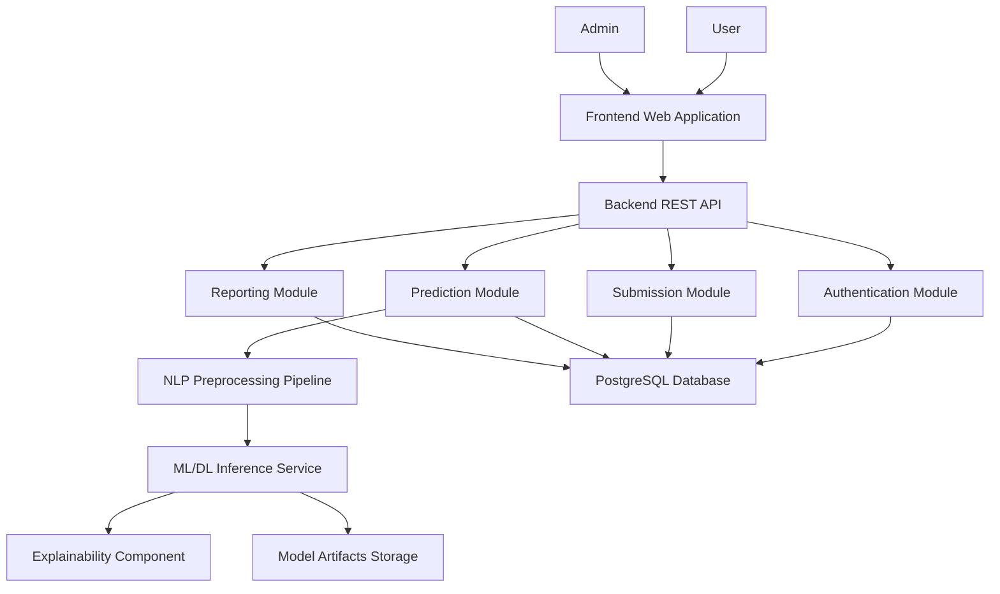
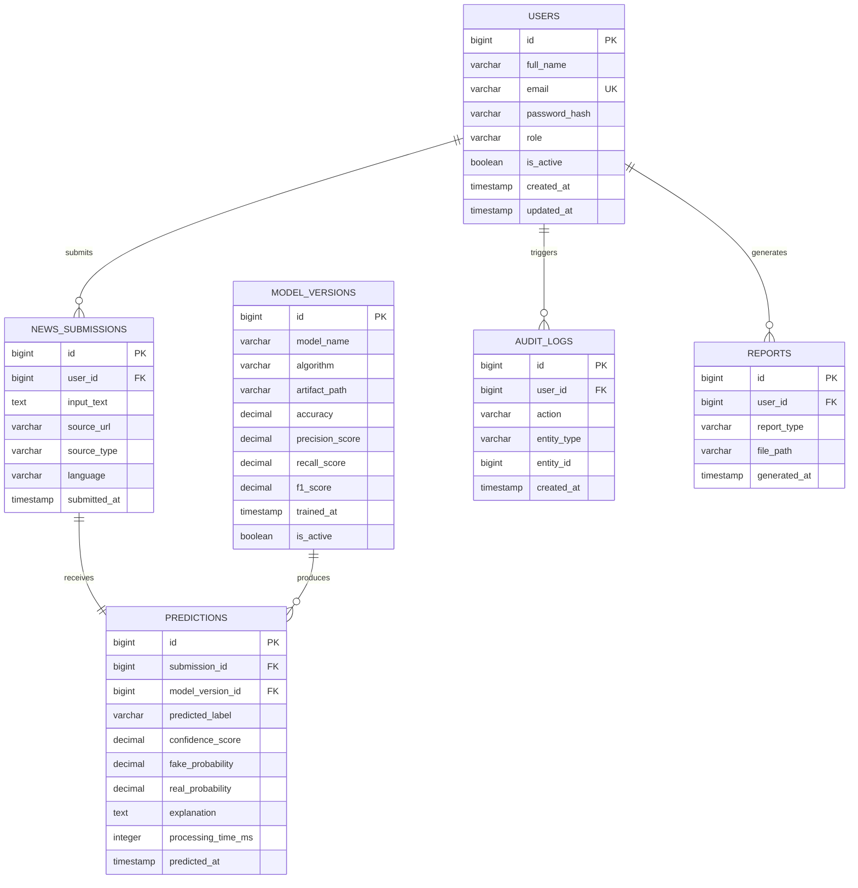
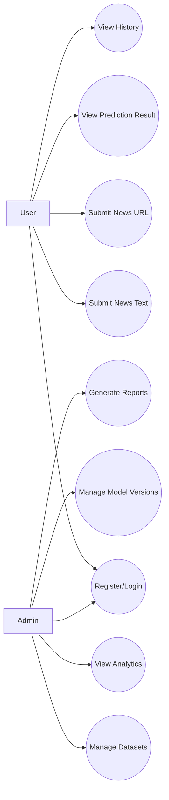
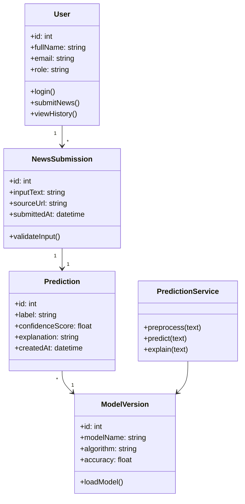
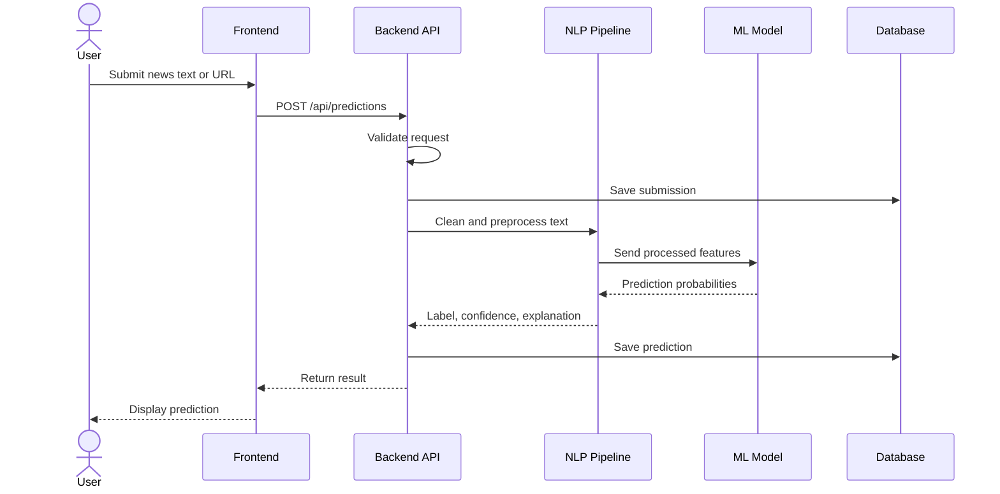
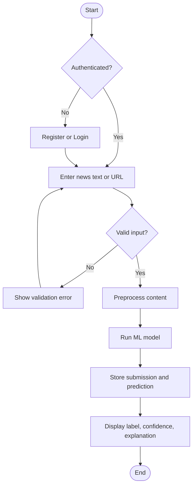
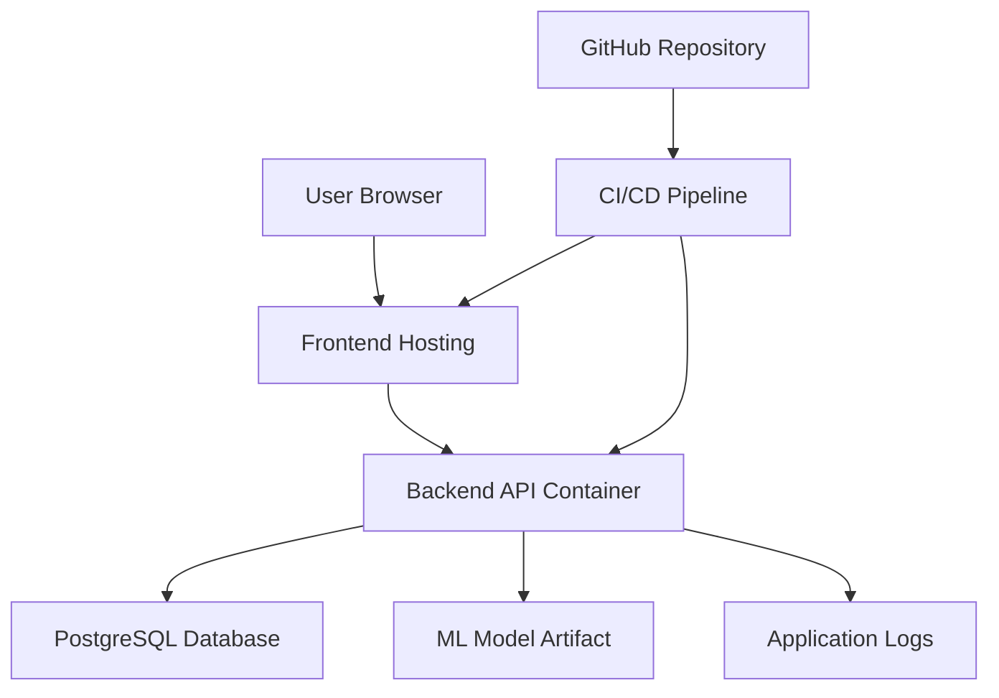
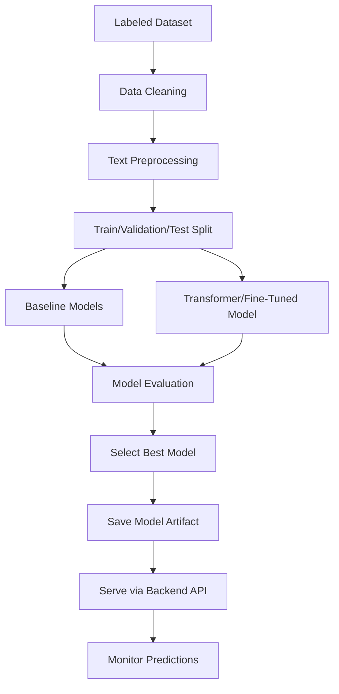

# AI-Based Fake News Detection System - Project Blueprint

> Status: Assumption-based starter blueprint.
>
> The uploaded proposal file is not currently available in the workspace. This document is based on the workspace topic "Fake news" and should be validated against the actual proposal when it is uploaded.

## 1. Complete Project Analysis

### 1.1 Project Domain

The project belongs to the domains of Artificial Intelligence, Natural Language Processing, Web Application Development, Data Science, and Misinformation Detection. The system focuses on identifying whether a news article, claim, headline, or text passage is likely to be real, fake, misleading, or suspicious using machine learning and NLP techniques.

### 1.2 Problem Statement

Fake news spreads quickly through online platforms and can influence public opinion, political decisions, health behavior, and social stability. Manual fact-checking is slow and difficult to scale. The proposed system aims to support users by providing an automated fake news detection platform that analyzes submitted news content and produces a prediction with a confidence score and supporting explanation.

### 1.3 Main Objectives

- Build a web-based system for fake news detection.
- Allow users to submit news text or URLs for analysis.
- Preprocess submitted content using NLP techniques.
- Train and evaluate machine learning or deep learning models on labeled fake/real news datasets.
- Predict whether submitted content is fake, real, misleading, or suspicious.
- Provide confidence scores and readable explanations.
- Maintain prediction history and administrative analytics.
- Produce reports useful for academic evaluation and system monitoring.

### 1.4 Expected Outcomes

- A functional web application for fake news checking.
- A trained AI/ML model with measurable performance.
- A backend API that serves prediction requests.
- A database that stores users, submissions, predictions, model versions, and reports.
- Documentation including SRS, design document, progress reports, final report, and viva presentation material.

### 1.5 Scope

In scope:

- User registration and authentication.
- News text submission.
- Optional news URL submission and extraction.
- AI-based fake news classification.
- Prediction confidence scoring.
- User prediction history.
- Admin dashboard.
- Dataset management for training and evaluation.
- Model performance reporting.
- Basic explainability using feature importance, highlighted terms, or model explanation tools.

Out of scope for the first version:

- Full real-time social media monitoring.
- Complete human fact-checking workflow with external journalist verification.
- Multilingual support unless required by the proposal.
- Browser extension unless explicitly required.
- Legal certification of truthfulness.

### 1.6 Limitations

- Predictions depend heavily on dataset quality and recency.
- The model may struggle with satire, sarcasm, partial truths, and emerging news.
- URL extraction can fail on websites with paywalls, JavaScript-heavy pages, or blocked scraping.
- AI predictions should support user judgment, not replace verified fact-checking.
- Bias may exist if the training dataset is politically, geographically, or linguistically imbalanced.

## 2. Requirements

### 2.1 Functional Requirements

| ID | Requirement | Priority |
|---|---|---|
| FR-01 | Users shall be able to register, log in, and log out. | High |
| FR-02 | Users shall be able to submit news text for fake news detection. | High |
| FR-03 | Users shall be able to submit a news URL if URL analysis is included. | Medium |
| FR-04 | The system shall preprocess submitted content before prediction. | High |
| FR-05 | The system shall classify submitted content as real, fake, misleading, or suspicious depending on model design. | High |
| FR-06 | The system shall display a confidence score for each prediction. | High |
| FR-07 | The system shall show a short explanation or key indicators behind the prediction. | Medium |
| FR-08 | Users shall be able to view their previous submissions and results. | Medium |
| FR-09 | Admin users shall be able to view system usage statistics. | Medium |
| FR-10 | Admin users shall be able to manage datasets and model metadata. | Medium |
| FR-11 | The system shall store prediction results for audit and reporting. | High |
| FR-12 | The system shall generate basic reports for academic and administrative use. | Medium |

### 2.2 Non-Functional Requirements

| ID | Requirement | Target |
|---|---|---|
| NFR-01 | Usability | The interface shall be simple enough for non-technical users. |
| NFR-02 | Performance | Standard text predictions should complete within 2-5 seconds after model warm-up. |
| NFR-03 | Accuracy | The selected model should achieve acceptable evaluation metrics, ideally above the baseline model. |
| NFR-04 | Security | Passwords must be hashed and API access must be authenticated where needed. |
| NFR-05 | Privacy | User submissions should be stored securely and not exposed to other users. |
| NFR-06 | Scalability | The architecture should allow separate scaling of frontend, backend, database, and ML inference. |
| NFR-07 | Maintainability | Code should be modular with clear separation between UI, API, database, and ML components. |
| NFR-08 | Reliability | The system should handle invalid text, empty input, broken URLs, and model errors gracefully. |
| NFR-09 | Explainability | The system should provide understandable prediction evidence when possible. |
| NFR-10 | Reproducibility | Model training code, dataset versions, and metrics should be documented. |

### 2.3 Missing and Hidden Requirements

- Dataset source, license, size, labels, and language must be specified.
- Evaluation metrics must include accuracy, precision, recall, F1-score, confusion matrix, and ROC-AUC where suitable.
- The system must define how to handle uncertain predictions.
- The system should log model version used for each prediction.
- The project should include ethical considerations and AI limitations.
- The system should include input validation and rate limiting.
- The final report should compare at least two model approaches.
- The UI should show a clear disclaimer that the result is AI-assisted, not legally authoritative.

## 3. System Architecture

### 3.1 Recommended Architecture



### 3.2 Architecture Rationale

The recommended architecture separates the user interface, backend business logic, database, and AI model workflow. This keeps the project maintainable and allows independent development of the ML pipeline and web application. FastAPI is recommended for the backend because it works naturally with Python-based ML models and provides automatic API documentation.

## 4. Database Design

### 4.1 Entity Relationship Diagram



### 4.2 Key Database Tables

- `users`: Stores registered user and admin accounts.
- `news_submissions`: Stores submitted news text or extracted URL content.
- `predictions`: Stores model output, confidence, explanation, and processing time.
- `model_versions`: Tracks trained model artifacts and evaluation metrics.
- `reports`: Stores generated report metadata.
- `audit_logs`: Tracks important actions for accountability.

## 5. UML Diagrams

### 5.1 Use Case Diagram



### 5.2 Class Diagram



### 5.3 Sequence Diagram - Prediction Flow



### 5.4 Activity Diagram



### 5.5 Deployment Diagram



## 6. AI/ML Architecture

### 6.1 AI Workflow



### 6.2 Recommended Model Strategy

Approach comparison:

| Approach | Pros | Cons | Recommendation |
|---|---|---|---|
| TF-IDF + Logistic Regression | Fast, explainable, easy to train | Lower semantic understanding | Use as baseline |
| TF-IDF + SVM | Strong traditional classifier | Less probability-friendly without calibration | Good baseline alternative |
| LSTM/BiLSTM | Learns sequence patterns | Needs more data and tuning | Optional if time allows |
| Transformer model | Strong language understanding | Higher compute cost | Best final model if resources allow |

Recommended path:

1. Start with TF-IDF + Logistic Regression as the baseline.
2. Compare against SVM or Random Forest.
3. If dataset and hardware permit, fine-tune a lightweight transformer such as DistilBERT.
4. Select the final model based on F1-score, recall for fake news, inference speed, and explainability.

### 6.3 Evaluation Metrics

- Accuracy
- Precision
- Recall
- F1-score
- Confusion matrix
- ROC-AUC for binary classification
- Inference latency
- Error analysis by category

## 7. Frontend Architecture

### 7.1 Recommended Pages

- Login page
- Registration page
- User dashboard
- News analysis page
- Prediction result page
- Prediction history page
- Admin dashboard
- Dataset management page
- Model performance page
- Reports page
- Profile/settings page

### 7.2 Frontend Component Structure

```text
frontend/
  src/
    app/
      routes/
      layouts/
    components/
      auth/
      dashboard/
      prediction/
      reports/
      admin/
      ui/
    services/
      apiClient.ts
      authService.ts
      predictionService.ts
    hooks/
    types/
    styles/
```

### 7.3 UI/UX Principles

- Keep the analysis form visible and simple.
- Display result label, confidence score, explanation, and disclaimer clearly.
- Use color carefully: green for likely real, red for likely fake, amber for uncertain.
- Provide prediction history for transparency.
- Avoid presenting the model output as absolute truth.

## 8. Backend Architecture

### 8.1 Recommended Backend Modules

```text
backend/
  app/
    main.py
    api/
      auth_routes.py
      prediction_routes.py
      admin_routes.py
      report_routes.py
    core/
      config.py
      security.py
    db/
      session.py
      models.py
      migrations/
    schemas/
      auth_schema.py
      prediction_schema.py
      report_schema.py
    services/
      auth_service.py
      prediction_service.py
      text_extraction_service.py
      report_service.py
    ml/
      preprocessing.py
      inference.py
      explainability.py
      artifacts/
    tests/
```

### 8.2 API Specification

| Method | Endpoint | Purpose | Auth |
|---|---|---|---|
| POST | `/api/auth/register` | Register user | No |
| POST | `/api/auth/login` | Login and receive token | No |
| GET | `/api/auth/me` | Get current user profile | Yes |
| POST | `/api/predictions` | Submit text or URL for prediction | Yes |
| GET | `/api/predictions/history` | Get current user's prediction history | Yes |
| GET | `/api/predictions/{id}` | Get prediction detail | Yes |
| GET | `/api/admin/analytics` | View admin analytics | Admin |
| POST | `/api/admin/datasets` | Upload dataset metadata or file | Admin |
| GET | `/api/admin/models` | List model versions | Admin |
| POST | `/api/reports` | Generate report | Yes |

Example prediction request:

```json
{
  "input_type": "text",
  "content": "Example news article text..."
}
```

Example prediction response:

```json
{
  "submission_id": 101,
  "prediction_id": 501,
  "label": "fake",
  "confidence_score": 0.91,
  "explanation": "The text contains sensational wording and patterns frequently associated with unreliable articles.",
  "model_version": "tfidf-logreg-v1"
}
```

## 9. Implementation Roadmap

### 9.1 Weekly Plan

| Week | Work |
|---|---|
| 1 | Finalize requirements, analyze proposal, prepare SRS. |
| 2 | Design architecture, UML diagrams, database schema, UI wireframes. |
| 3 | Set up repository, backend skeleton, frontend skeleton, database. |
| 4 | Implement authentication and user management. |
| 5 | Build news submission and prediction history features. |
| 6 | Collect dataset, clean data, create baseline ML model. |
| 7 | Evaluate baseline models and select candidate model. |
| 8 | Integrate ML inference with backend API. |
| 9 | Build user dashboard and prediction result UI. |
| 10 | Build admin analytics, model metadata, and report module. |
| 11 | Testing, security hardening, error handling, deployment setup. |
| 12 | Final documentation, final report, viva presentation, demo rehearsal. |

### 9.2 Development Task Order

1. Confirm proposal requirements.
2. Create final SRS.
3. Create Git repository structure.
4. Configure backend project.
5. Configure frontend project.
6. Design database migrations.
7. Implement authentication.
8. Implement user roles.
9. Implement news submission API.
10. Implement text preprocessing module.
11. Train baseline ML model.
12. Save and load model artifact.
13. Implement prediction API.
14. Implement prediction result UI.
15. Implement prediction history.
16. Implement admin dashboard.
17. Implement reporting.
18. Add tests.
19. Add deployment configuration.
20. Prepare final documentation and viva material.

## 10. Testing Strategy

### 10.1 Backend Testing

- Unit tests for services and validators.
- API tests for authentication and prediction endpoints.
- Database integration tests for submission and prediction storage.
- Security tests for unauthorized access.

### 10.2 ML Testing

- Dataset quality checks.
- Train/test split validation.
- Baseline comparison.
- Confusion matrix analysis.
- False positive and false negative analysis.
- Model inference latency testing.

### 10.3 Frontend Testing

- Form validation tests.
- Authentication flow tests.
- Prediction result display tests.
- Responsive layout checks.
- Admin page access checks.

### 10.4 User Acceptance Testing

- User can register and log in.
- User can submit a news article.
- User receives a prediction result.
- User can view previous results.
- Admin can view analytics and model metadata.

## 11. Security Measures

- Hash passwords using bcrypt or Argon2.
- Use JWT access tokens with expiration.
- Validate all user inputs.
- Limit maximum text length.
- Sanitize URL inputs.
- Restrict admin routes by role.
- Store secrets in environment variables.
- Enable CORS only for allowed frontend origins.
- Add rate limiting for prediction endpoints.
- Avoid storing sensitive personal data unnecessarily.

## 12. Deployment Approach

Recommended deployment:

- Frontend: Vercel, Netlify, or static hosting.
- Backend: Render, Railway, Fly.io, or VPS Docker deployment.
- Database: Managed PostgreSQL.
- Model artifacts: Local backend storage for prototype; object storage for production.
- CI/CD: GitHub Actions for tests and deployment.

Docker-based deployment is recommended because it improves reproducibility for final-year demonstrations.

## 13. Project Risks and Mitigation

| Risk | Impact | Mitigation |
|---|---|---|
| Poor dataset quality | Low model accuracy | Use reputable datasets and document preprocessing. |
| Model overfitting | Weak real-world performance | Use validation split, regularization, and error analysis. |
| URL scraping failure | Broken user workflow | Keep text submission as the primary reliable input. |
| Misleading AI confidence | User over-trust | Add explanation and disclaimer. |
| Limited compute resources | Cannot train large models | Start with TF-IDF baselines and use lightweight transformer only if feasible. |
| Scope creep | Delayed delivery | Prioritize core prediction flow first. |
| Security weaknesses | Data exposure | Implement authentication, authorization, validation, and secure password handling. |

## 14. Documentation Plan

### 14.1 Proposal

- Background and problem statement.
- Aim and objectives.
- Literature review summary.
- Methodology.
- Tools and technologies.
- Expected outcome.
- Timeline.

### 14.2 SRS

- Introduction.
- Overall description.
- Functional requirements.
- Non-functional requirements.
- External interface requirements.
- System features.
- Data requirements.
- Constraints and assumptions.

### 14.3 Design Document

- Architecture overview.
- UML diagrams.
- Database schema.
- API design.
- AI model design.
- UI page structure.
- Security design.
- Deployment design.

### 14.4 Progress Reports

- Completed tasks.
- Current implementation status.
- Issues and risks.
- Screenshots.
- Test results.
- Next milestones.

### 14.5 Final Report

- Abstract.
- Introduction.
- Literature review.
- Methodology.
- System analysis and design.
- Implementation.
- Testing and evaluation.
- Results and discussion.
- Limitations.
- Future enhancements.
- Conclusion.

### 14.6 Viva Presentation

- Title and project overview.
- Problem statement.
- Objectives.
- System architecture.
- AI/ML workflow.
- Demonstration flow.
- Results and evaluation.
- Challenges.
- Future work.
- Conclusion.

## 15. Recommended Immediate Next Steps

1. Upload the actual project proposal to the workspace.
2. Replace this document's assumptions with proposal-specific facts.
3. Finalize the SRS.
4. Decide the target model strategy and dataset.
5. Start implementation with repository setup and backend/frontend skeletons.
