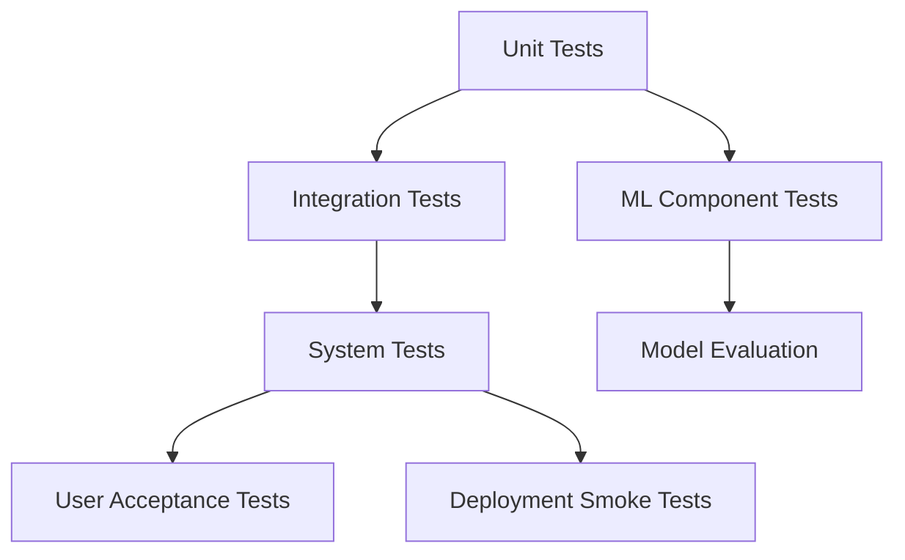

# Testing and QA Plan

## AI-Based Fake News Detection System

> Status: Assumption-based testing plan.
>
> The official proposal is not currently available in the workspace. This plan should be updated after proposal review and after the final implementation stack is confirmed.

## 1. Testing Objectives

The objective of testing is to verify that the system:

- Satisfies the SRS requirements.
- Correctly authenticates and authorizes users.
- Accepts valid news submissions and rejects invalid input.
- Produces AI prediction results with label, confidence, explanation, and model version.
- Stores and retrieves prediction history correctly.
- Protects user data and admin-only features.
- Handles model, database, and validation failures gracefully.
- Provides credible ML evaluation evidence for academic assessment.

## 2. Testing Scope

### 2.1 In Scope

- Backend unit testing.
- API integration testing.
- Frontend workflow testing.
- Database integrity testing.
- ML pipeline testing.
- Security testing.
- User acceptance testing.
- Deployment smoke testing.

### 2.2 Out of Scope for First Version

- Large-scale load testing.
- Formal penetration testing.
- Cross-browser testing across legacy browsers.
- Legal verification of factual correctness.
- Production-grade model monitoring.

## 3. Test Levels



## 4. Functional Test Cases

### 4.1 Authentication

| Test ID | Scenario | Steps | Expected Result | Priority |
|---|---|---|---|---|
| FT-AUTH-01 | Register valid user | Submit valid name, email, password | User account created | P0 |
| FT-AUTH-02 | Reject duplicate email | Register using existing email | API returns conflict error | P0 |
| FT-AUTH-03 | Reject invalid email | Submit invalid email format | Validation error shown | P0 |
| FT-AUTH-04 | Login valid user | Submit valid credentials | Token returned and dashboard opens | P0 |
| FT-AUTH-05 | Reject invalid login | Submit wrong password | Unauthorized error shown | P0 |
| FT-AUTH-06 | Protect private route | Open dashboard without token | Redirect or unauthorized response | P0 |
| FT-AUTH-07 | Protect admin route | Normal user opens admin page | Access denied | P0 |

### 4.2 News Submission and Prediction

| Test ID | Scenario | Steps | Expected Result | Priority |
|---|---|---|---|---|
| FT-PRED-01 | Submit valid text | Enter valid news text and submit | Prediction result displayed | P0 |
| FT-PRED-02 | Reject empty text | Submit empty form | Validation error shown | P0 |
| FT-PRED-03 | Reject oversized text | Submit text above max length | Validation error shown | P0 |
| FT-PRED-04 | Submit valid URL | Submit article URL if URL mode enabled | Text extracted and prediction returned | P1 |
| FT-PRED-05 | Handle invalid URL | Submit invalid URL | Friendly error shown | P1 |
| FT-PRED-06 | Store prediction | Submit valid news text | Submission and prediction saved | P0 |
| FT-PRED-07 | Show model version | View prediction result | Model name/version visible | P1 |
| FT-PRED-08 | Show disclaimer | View prediction result | AI-assisted disclaimer visible | P1 |

### 4.3 Prediction History

| Test ID | Scenario | Steps | Expected Result | Priority |
|---|---|---|---|---|
| FT-HIST-01 | View own history | User opens history page | Own predictions shown | P0 |
| FT-HIST-02 | Block other user data | User requests another user's prediction | Forbidden or not found response | P0 |
| FT-HIST-03 | Pagination works | User has many predictions | Page controls return correct data | P1 |
| FT-HIST-04 | View prediction detail | Open previous prediction | Detail page displays stored result | P1 |

### 4.4 Admin Features

| Test ID | Scenario | Steps | Expected Result | Priority |
|---|---|---|---|---|
| FT-ADMIN-01 | View analytics | Admin opens dashboard | Summary metrics displayed | P1 |
| FT-ADMIN-02 | View model versions | Admin opens model page | Model metrics listed | P1 |
| FT-ADMIN-03 | Activate model | Admin activates another model | Selected model becomes active | P2 |
| FT-ADMIN-04 | Generate report | Admin generates report | Report metadata saved | P1 |

## 5. API Test Cases

| Test ID | Endpoint | Method | Expected Verification |
|---|---|---|---|
| API-01 | `/health` | GET | Returns `status: ok`. |
| API-02 | `/api/auth/register` | POST | Creates user with hashed password. |
| API-03 | `/api/auth/login` | POST | Returns valid bearer token. |
| API-04 | `/api/auth/me` | GET | Returns authenticated user profile. |
| API-05 | `/api/predictions` | POST | Returns label, confidence, explanation, model version. |
| API-06 | `/api/predictions/history` | GET | Returns paginated current-user history. |
| API-07 | `/api/predictions/{id}` | GET | Enforces ownership. |
| API-08 | `/api/admin/analytics` | GET | Requires admin role. |
| API-09 | `/api/admin/models` | GET | Requires admin role. |
| API-10 | `/api/reports` | POST | Creates report metadata. |

## 6. Database Testing

| Test ID | Scenario | Expected Result |
|---|---|---|
| DB-01 | Insert user with unique email | Insert succeeds. |
| DB-02 | Insert user with duplicate email | Insert fails. |
| DB-03 | Insert submission without user | Insert fails. |
| DB-04 | Insert prediction without model version | Insert fails. |
| DB-05 | Insert confidence above 1 | Insert fails. |
| DB-06 | Delete user | Related submissions are deleted or handled according to FK rules. |
| DB-07 | Activate two models | Partial unique index prevents more than one active model. |

## 7. ML Testing and Evaluation

### 7.1 ML Pipeline Tests

| Test ID | Scenario | Expected Result |
|---|---|---|
| ML-01 | Dataset file loads | Required columns are present. |
| ML-02 | Missing text values handled | Cleaning removes or fills invalid rows. |
| ML-03 | Labels normalized | Labels match expected classes. |
| ML-04 | Train/test split created | Split is reproducible with fixed random seed. |
| ML-05 | Model trains successfully | Model artifact is created. |
| ML-06 | Model loads successfully | Inference wrapper loads artifact. |
| ML-07 | Model predicts valid text | Label and confidence returned. |
| ML-08 | Empty text handled | Controlled validation or fallback behavior. |

### 7.2 Evaluation Metrics

The final report should include:

- Accuracy.
- Precision.
- Recall.
- F1-score.
- Confusion matrix.
- ROC-AUC for binary classification if applicable.
- Inference latency.
- Model comparison table.
- Error analysis for false positives and false negatives.

### 7.3 Minimum Model Acceptance Criteria

The model should:

- Beat a simple majority-class baseline.
- Produce consistent predictions after artifact reload.
- Return confidence scores between 0 and 1.
- Complete inference within the target response time for normal text length.
- Be accompanied by documented limitations.

## 8. Security Testing

| Test ID | Scenario | Expected Result |
|---|---|---|
| SEC-01 | Password storage inspection | Password is hashed, not plain text. |
| SEC-02 | Missing token on protected API | API returns unauthorized. |
| SEC-03 | Invalid token on protected API | API returns unauthorized. |
| SEC-04 | Normal user opens admin endpoint | API returns forbidden. |
| SEC-05 | SQL injection-like input | Input is treated as text and does not affect database. |
| SEC-06 | Oversized request body | API rejects request. |
| SEC-07 | Raw backend error | User receives safe error message, not stack trace. |

## 9. Performance Testing

| Test ID | Scenario | Target |
|---|---|---|
| PERF-01 | Health endpoint response | Under 500 ms locally. |
| PERF-02 | Login response | Under 1 second locally. |
| PERF-03 | Text prediction after model warm-up | 2-5 seconds for normal input. |
| PERF-04 | History query with pagination | Under 1 second for normal dataset. |
| PERF-05 | Model artifact load at startup | Completes without delaying every request. |

## 10. Frontend QA Checklist

- Login form validates required fields.
- Registration form validates email and password.
- Analyze page rejects empty text.
- Prediction loading state is visible.
- Result page shows label, confidence, explanation, model version, and disclaimer.
- History page handles empty state.
- API errors are shown as friendly messages.
- Admin navigation is hidden or blocked for normal users.
- Layout works on desktop and mobile.
- Text does not overflow buttons, cards, or tables.

## 11. User Acceptance Testing

### UAT Scenario 1: Normal User Prediction

1. Register a new user.
2. Log in.
3. Submit news text.
4. View prediction result.
5. Open prediction history.

Pass criteria:

- User completes the journey without technical assistance.
- Result is understandable.
- History contains the submitted item.

### UAT Scenario 2: Admin Review

1. Log in as admin.
2. Open admin dashboard.
3. View prediction counts.
4. View model metrics.
5. Generate or view report.

Pass criteria:

- Admin features are accessible only to admin.
- Analytics match stored data.

## 12. Test Evidence to Collect

For the final report, collect:

- Screenshots of test execution.
- API test outputs.
- Frontend screenshots.
- Database records showing stored predictions.
- Confusion matrix image.
- Model metric table.
- Deployment smoke test screenshot.
- Bug list and fixes.

## 13. Bug Report Template

```markdown
# Bug Report

## ID

BUG-001

## Title

Short bug title

## Environment

Local / deployed URL / browser / backend version

## Steps to Reproduce

1. Step one
2. Step two
3. Step three

## Expected Result

What should happen

## Actual Result

What happened

## Severity

Low / Medium / High / Critical

## Status

Open / In Progress / Fixed / Verified

## Fix Summary

Brief description of fix
```

## 14. Final QA Sign-Off Checklist

- Core user flow works end to end.
- Authentication and authorization work.
- Prediction API works.
- Prediction history works.
- Admin dashboard works if included.
- Model metrics are documented.
- At least one model comparison is documented if required.
- Security basics are implemented.
- Deployment or local setup instructions are verified.
- Final report contains testing evidence.
