# UML and System Diagrams

## AI-Based Fake News Detection System

> Status: Assumption-based diagram set.
>
> The official proposal is not currently available in the workspace. These diagrams should be validated and updated after proposal review.

## 1. Use Case Diagram

This diagram shows the main actors and the system functions they can perform.

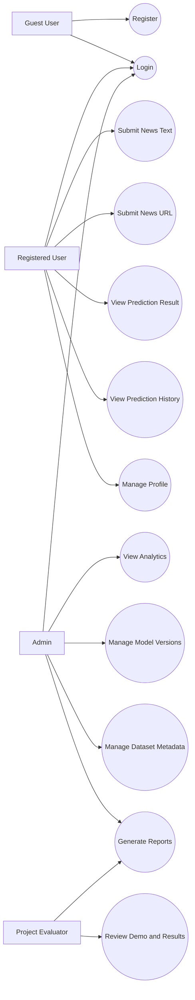

## 2. Class Diagram

This diagram shows the main domain classes and service classes.

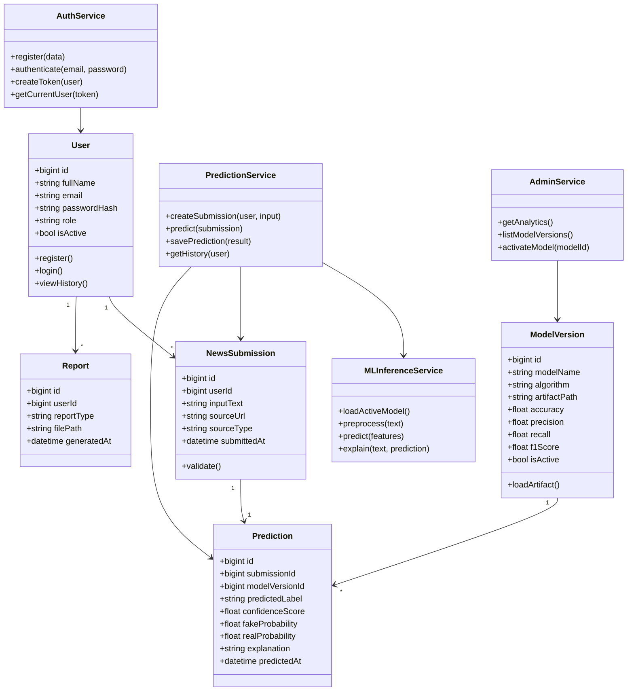

## 3. Sequence Diagram - User Login

This diagram explains the authentication flow.

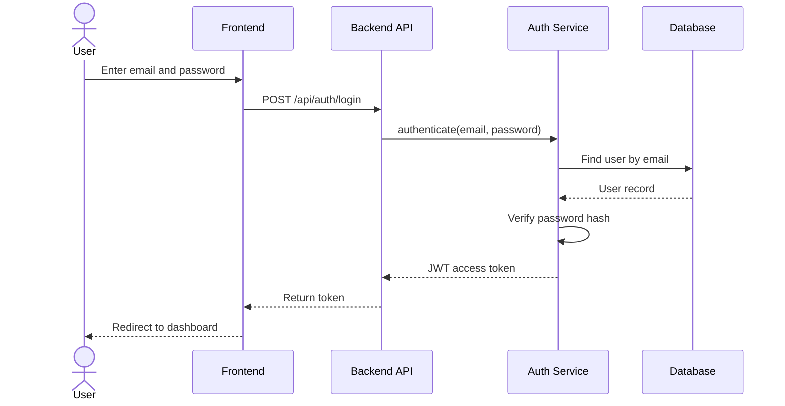

## 4. Sequence Diagram - Fake News Prediction

This diagram shows the end-to-end prediction flow.

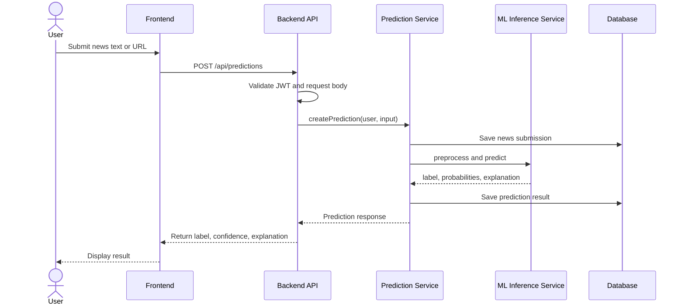

## 5. Activity Diagram - News Analysis

This diagram shows the user workflow and validation decisions.

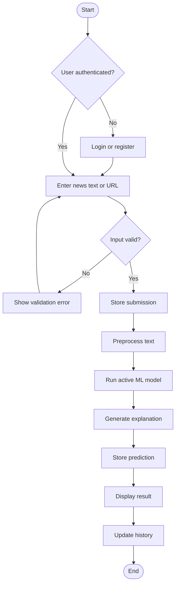

## 6. Component Diagram

This diagram shows the main implementation components and their dependencies.

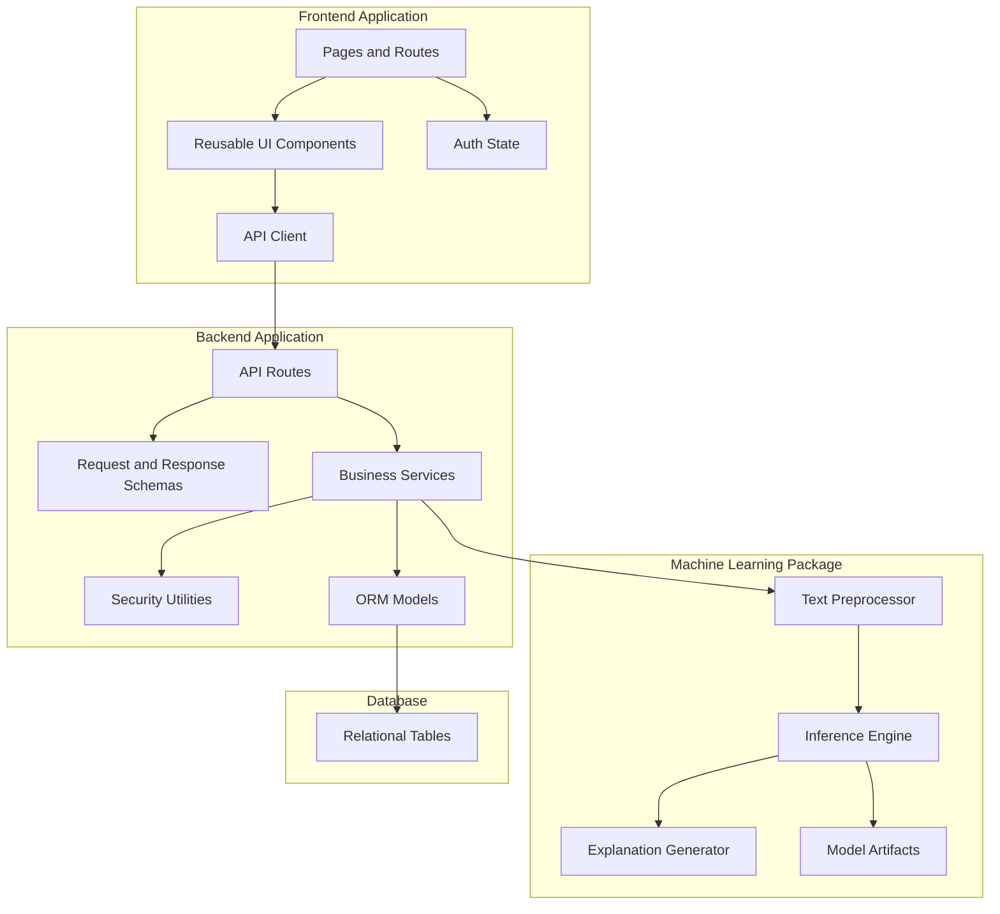

## 7. Deployment Diagram

This diagram shows a practical final-year deployment model.

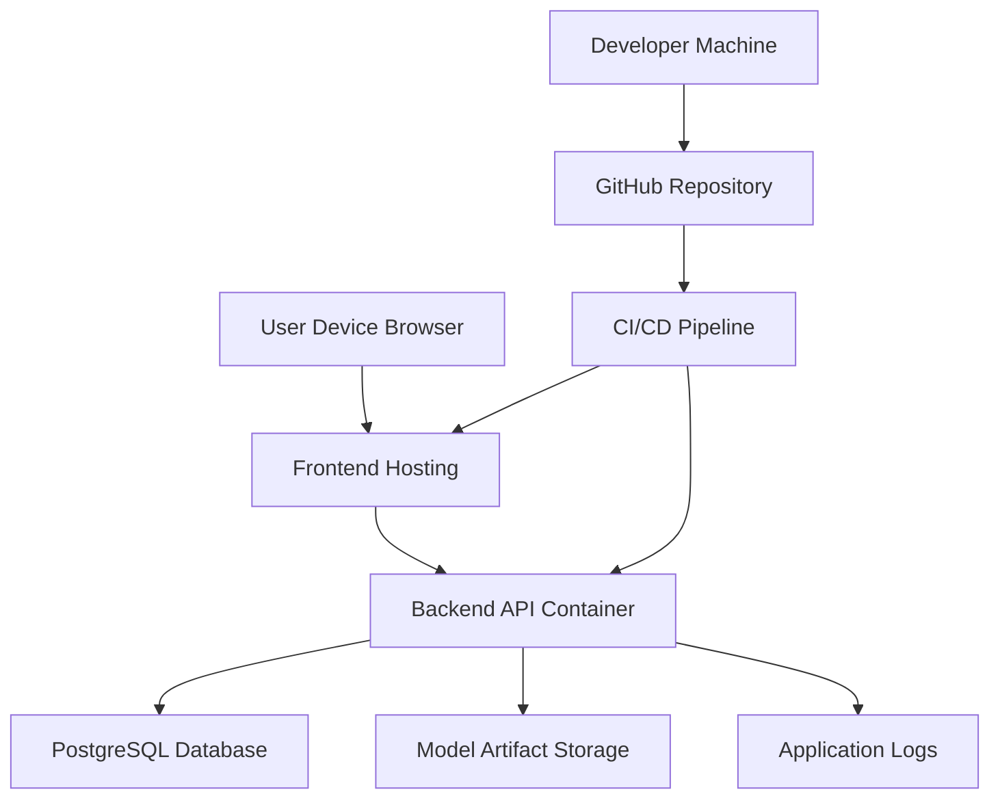

## 8. Entity Relationship Diagram

This diagram models the database relationships.

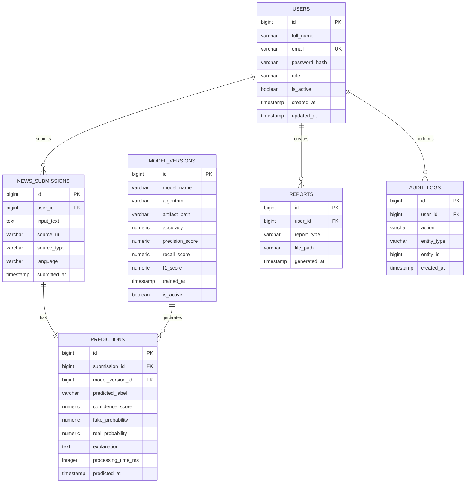

## 9. AI/ML Training Workflow

This diagram shows how the model is trained and selected.

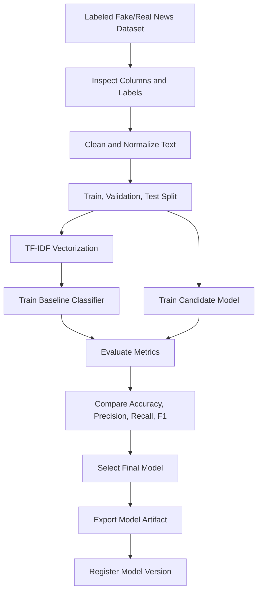

## 10. AI/ML Inference Workflow

This diagram shows how live user input becomes a prediction.

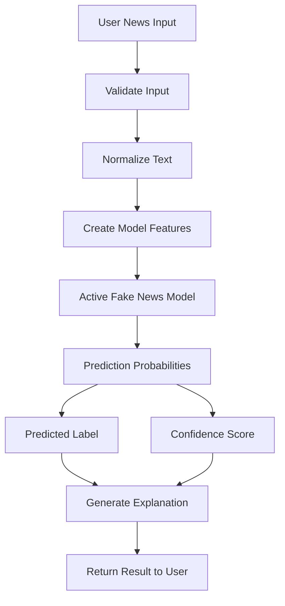

## 11. State Diagram - Prediction Lifecycle

This diagram shows the lifecycle of a prediction request.

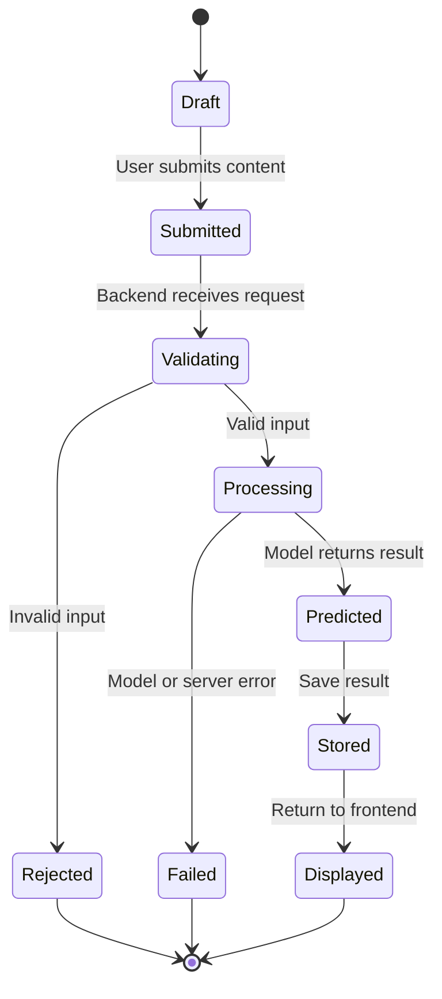

## 12. Data Flow Diagram

This diagram shows how data moves through the system.

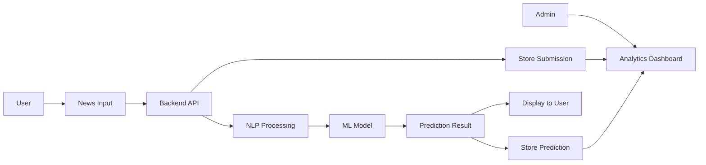

## 13. Diagram Update Checklist

Update these diagrams after the official proposal is reviewed:

- Confirm actors and user roles.
- Confirm whether URL submission is required.
- Confirm prediction labels.
- Confirm admin module scope.
- Confirm exact database entities.
- Confirm final AI model approach.
- Confirm deployment target.
